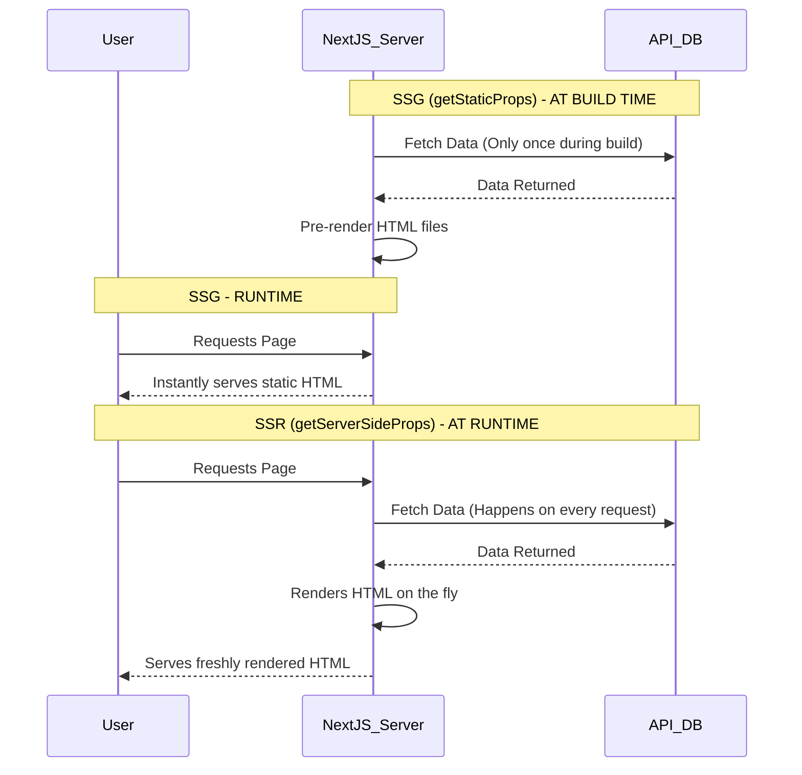

# Session 8 – Data Fetching in Next.js

**Q1. Create a Next.js page called trending-movies.js that fetches a list of trending movies from a mock API using getStaticProps and displays their titles and poster images when the page loads.**

**Answer 1:**
**pages/trending-movies.js:**
```jsx
import React from 'react';

export default function TrendingMovies({ movies }) {
  return (
    <div>
      <h1>Trending Movies</h1>
      <div style={{ display: 'flex', gap: '20px' }}>
        {movies.map((movie) => (
          <div key={movie.id}>
            
            <h3>{movie.title}</h3>
          </div>
        ))}
      </div>
    </div>
  );
}

// Executes at BUILD time (SSG)
export async function getStaticProps() {
  // Simulating an API call
  const mockMovies = [
    { id: 1, title: 'Inception', poster: 'https://via.placeholder.com/150' },
    { id: 2, title: 'Interstellar', poster: 'https://via.placeholder.com/150' }
  ];

  return {
    props: {
      movies: mockMovies
    }
  };
}
```

**Q2. Build a Next.js page called my-orders.js that uses getServerSideProps to fetch and display a user's recent food orders (simulate Zomato/Swiggy) from a mock API every time the page is requested.**

**Answer 2:**
**pages/my-orders.js:**
```jsx
import React from 'react';

export default function MyOrders({ orders }) {
  return (
    <div>
      <h1>My Recent Zomato Orders</h1>
      <ul>
        {orders.map((order) => (
          <li key={order.id}>
            <strong>{order.title}</strong> - Delivered!
          </li>
        ))}
      </ul>
    </div>
  );
}

// Executes on EVERY request (SSR)
export async function getServerSideProps() {
  // Using JSONPlaceholder as a free mock API
  const res = await fetch('https://jsonplaceholder.typicode.com/posts?_limit=3');
  const data = await res.json();

  return {
    props: {
      orders: data
    }
  };
}
```

**Q3. Add a new page called [id].js inside a pages/products/ folder in your Next.js app. Use getStaticPaths to pre-generate paths for 5 fake Flipkart product IDs, and use getStaticProps to fetch and display product details for each.**

**Answer 3:**
**pages/products/[id].js:**
```jsx
const mockDatabase = [
  { id: '1', name: 'Smartphone', price: '₹15,000' },
  { id: '2', name: 'Laptop', price: '₹55,000' },
  { id: '3', name: 'Headphones', price: '₹2,000' },
  { id: '4', name: 'Smartwatch', price: '₹4,500' },
  { id: '5', name: 'Tablet', price: '₹25,000' }
];

export default function ProductDetail({ product }) {
  if (!product) return <p>Product not found.</p>;

  return (
    <div>
      <h1>Flipkart Product Page</h1>
      <h2>{product.name}</h2>
      <p>Price: {product.price}</p>
    </div>
  );
}

export async function getStaticPaths() {
  // Pre-generating paths for the 5 fake IDs
  const paths = mockDatabase.map((product) => ({
    params: { id: product.id }
  }));

  return { paths, fallback: false };
}

export async function getStaticProps({ params }) {
  // Finding the product detail from the local array
  const product = mockDatabase.find((p) => p.id === params.id);
  
  return {
    props: { product }
  };
}
```

**Q4. Integrate a GraphQL query inside getStaticProps to fetch a list of 5 latest music albums (simulate Spotify) and display their names and artists on a Next.js page called latest-albums.js.**

**Answer 4:**
*(Using a mocked GraphQL integration approach via `apollo/client` or a basic `fetch` request).*
**pages/latest-albums.js:**
```jsx
export default function LatestAlbums({ albums }) {
  return (
    <div>
      <h1>Latest Spotify Albums</h1>
      <ul>
        {albums.map((album) => (
          <li key={album.id}>
            {album.name} by <strong>{album.artist}</strong>
          </li>
        ))}
      </ul>
    </div>
  );
}

export async function getStaticProps() {
  // Mocking the GraphQL endpoint fetch
  const mockGraphQLResponse = {
    data: {
      albums: [
        { id: 1, name: "Dawn FM", artist: "The Weeknd" },
        { id: 2, name: "Midnights", artist: "Taylor Swift" },
        { id: 3, name: "Renaissance", artist: "Beyoncé" },
        { id: 4, name: "Harry's House", artist: "Harry Styles" },
        { id: 5, name: "Utopia", artist: "Travis Scott" }
      ]
    }
  };

  return {
    props: {
      albums: mockGraphQLResponse.data.albums
    }
  };
}
```

**Q5. Draw a diagram (hand-drawn and scanned or digital) that compares SSR (getServerSideProps) vs SSG (getStaticProps) in Next.js. Upload your diagram as an image and write 2-3 lines explaining the difference in your own words.**

**Answer 5:**
**(Digital Diagram representation via Mermaid Markdown):**



**Explanation:**
Server-Side Rendering (SSR) fetches fresh data and generates the HTML document *every single time* a user requests the page (ideal for frequently changing data like user dashboards). In contrast, Static Site Generation (SSG) fetches data and builds the HTML document *only once at build time*, serving the exact same hyper-fast static file to all users (ideal for blogs or marketing pages).
